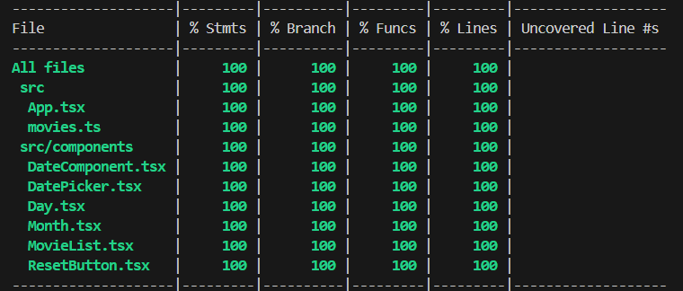

README

# Testning - Uppgift 1.

## Beskrivning

Det här projektet är byggt med Vite, React och Tailwind. Jag har skapat komponenterna DateComponent, Day och Month som visar datum, veckodag och månad. Utöver det har jag skapat komponenterna DatePicker, Movielist och ResetButtton.
Med DatePicker väljer du ett datum. I Movielist visas en lista på filmer dels genom valt datum eller hela listan som standard. ResetButton återställer DatePicker till dagens datum och Movielist så att den visar hela listan.

Nedan finns listor på enhetstester och integrationstester.

### Enhetstester + Ingrationstester

- DateComponent.test.tsx (2 tests)
- MovieList.test.tsx (5 tests)
- ResetButton.test.tsx (3 tests)
- App.test.tsx (4 test)
- DatePicker.test.tsx (6 test)
- Month.test.tsx (1 test)
- Day.test.tsx (1 test)

### Coverage

## Installation

Kör `npm install` för att installera alla paket.

## Utveckling

Kör `npm run dev` för att starta utvecklingsservern.

## Testning

Kör `npm test` för att köra testerna.

## Coverage

Kör `npm run coverage` för att se coverage
